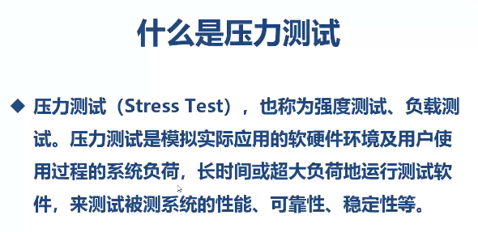
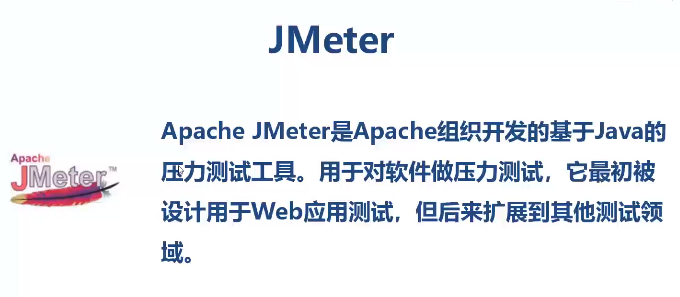
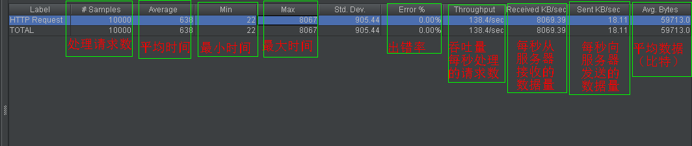
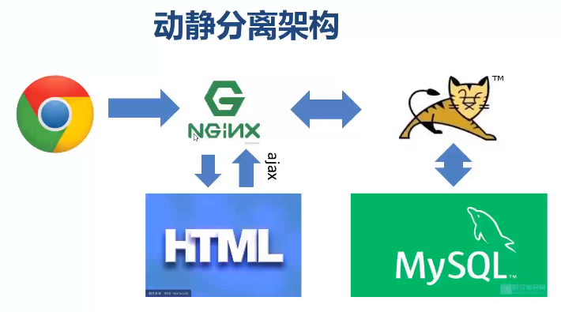

1. 新建一个springboot项目，添加框架支持：web、mysql、thymeleaf、lombok，创建完毕后，加入MyBatisPlus的依赖

```xml
<!-- MyBatisPlus依赖 -->
<dependency>
    <groupId>com.baomidou</groupId>
    <artifactId>mybatis-plus-boot-starter</artifactId>
    <version>3.2.0</version>
</dependency>
```

2. 设计数据库，爬取网站数据插入数据表
3. easycode生成代码
4. 改写静态页面，写controller测试

5. 压力测试

   
   JMeter
   
   



6. 整合redis做缓存
```xml
<!--用redis缓存-->
<dependency>
    <groupId>org.springframework.boot</groupId>
    <artifactId>spring-boot-starter-data-redis</artifactId>
</dependency>

<!--使用缓存-->
<dependency>
    <groupId>org.springframework.boot</groupId>
    <artifactId>spring-boot-starter-cache</artifactId>
</dependency>
```

7. 主启动类上添加@EnableCaching注解开启缓存
8. 在操作数据库的方法上增加@Cacheable(value = "covers", key = "#goodsId")注解

9. 爬数据用到了hutool工具类和fastjson

```xml
<!-- Hutool -->
<dependency>
    <groupId>cn.hutool</groupId>
    <artifactId>hutool-all</artifactId>
    <version>5.2.3</version>
</dependency>
<!--fastjson-->
<dependency>
    <groupId>com.alibaba</groupId>
    <artifactId>fastjson</artifactId>
    <version>1.2.46</version>
</dependency>>
```

任务调度方式页面静态化

```java
package com.kk.scheduler;

/*
@author kzj
@date 2020/4/28 - 14:43
*/

import com.kk.entity.Goods;
import com.kk.service.*;
import org.springframework.scheduling.annotation.Scheduled;
import org.springframework.stereotype.Component;
import org.thymeleaf.TemplateEngine;
import org.thymeleaf.context.Context;

import javax.annotation.Resource;
import java.io.File;
import java.io.FileNotFoundException;
import java.io.PrintWriter;
import java.io.UnsupportedEncodingException;
import java.util.HashMap;
import java.util.List;
import java.util.Map;

/**
 * 创建任务调度，每五分钟进行一次，对更新的商品，重新生成静态页面
 */
@Component
public class StaticTask {

    @Resource
    GoodsService goodsService;
    @Resource
    TemplateEngine templateEngine;
    @Resource
    private GoodsCoverService goodsCoverService;
    @Resource
    private GoodsDetailService goodsDetailService;
    @Resource
    private GoodsParamService goodsParamService;
    @Resource
    private EvaluateService evaluateService;


    @Scheduled(cron = "0 0/5 * * * ? ")
    public void doStatic(){
        List<Goods> last5M = goodsService.findLast5M();
        for (Goods goods : last5M) {
            Integer goodsId = goods.getGoodsId();
            Map<String, Object> map = new HashMap<>();
            map.put("good", goodsService.findGoodById(goodsId));
            map.put("cover", goodsCoverService.findCover(goodsId));
            map.put("details", goodsDetailService.findDetails(goodsId));
            map.put("gdparams", goodsParamService.findParams(goodsId));
            map.put("evaluates", evaluateService.findEvaluates(goodsId));

            // 上下文对象
            Context context = new Context();
            context.setVariables(map);
            // 文件对象
            File file = new File("D:/jumei/goods/" + goodsId + ".html");
            if (file.exists()) {
                // 如果文件存在，则删除
                file.delete();
            }
            PrintWriter printWriter = null;
            try {
                // PrintWriter用来创建一个文件并向文本文件写入数据。可以理解为java中的文件输出
                printWriter = new PrintWriter(file, "UTF-8");
                templateEngine.process("jumei.html", context, printWriter);
            } catch (FileNotFoundException | UnsupportedEncodingException e) {
                e.printStackTrace();
            } finally {
                printWriter.close();
            }
            System.out.println("更新了"+goodsId+"商品");
        }
    }

}

```

动静分离（评论数据为动数据）




